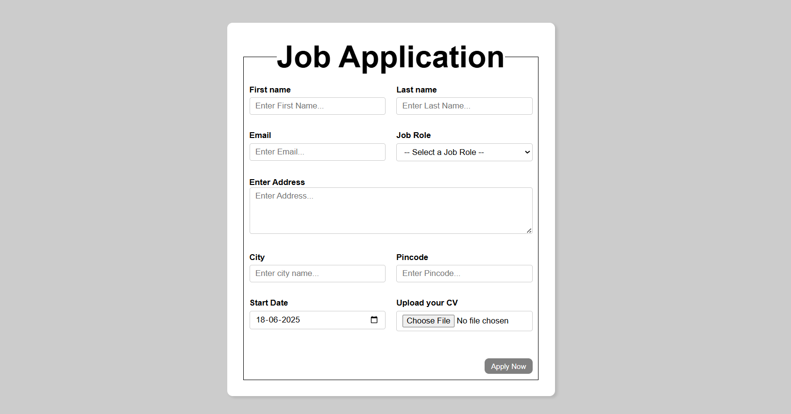

# 📝 Job Application Form

A responsive and semantically structured job application form built using **HTML5** and **CSS3**. It collects applicant details such as name, email, city, address, preferred job role, and allows CV/resume uploads. The design is responsive and accessible.

---

## Live Link


## 🌟 Features

- ✅ Semantic HTML with `<fieldset>`, `<legend>`, and labeled form controls
- 📱 Responsive layout using CSS Grid and Flexbox
- 🔒 HTML5 `required` validations for key inputs
- 📎 File upload input (CV in `.pdf`, `.doc`, `.docx`)
- 🧠 Dropdown selection for 15+ common job roles
- 📅 Date input for availability
- 🎯 Clear UI with focus and hover states for better UX

---

## 🛠️ Tech Stack

- **HTML5**
- **CSS3** (Flexbox + Grid)

---

## 📸 Screenshot



---

## 📁 Project Structure

```

📦 Job Application Form
├── index.html       # Main HTML file
├── style.css        # CSS file
└── README.md        # This file

````

---

## 🚀 How to Run

1. **Clone this repository** or download the files:

```bash
git clone https://github.com/harshika2112/Job-Application-Form.git
````

2. **Open `index.html`** in any web browser (Chrome, Firefox, Edge, etc.)

3. **Optional:** Replace the form `action="/submit"` with your backend URL or use a service like [FormSubmit](https://formsubmit.co/) for demo testing.

---

## 📌 Future Enhancements

* Add client-side validation using JavaScript
* Integrate with backend (e.g., Node.js, PHP, Firebase)
* Store submissions in a database
* Display confirmation messages or redirect upon submit

---

## 🙋‍♀️ Author

**Harshika Bansal**
